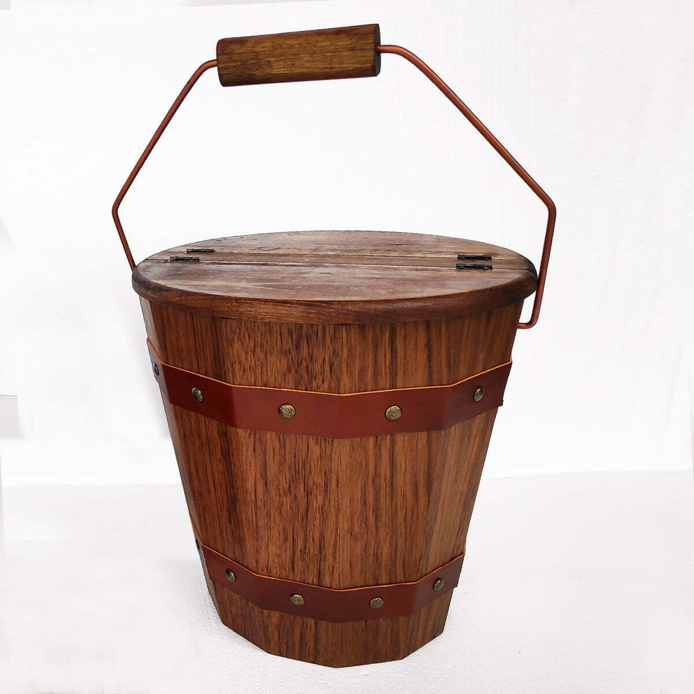

# How to feed your duck


## Abstract

This is a guide, how to feed your **ducks**. If you follow the instructions below, the results will be happy **ducks**.

## Duckscription

> The domestic duck or domestic mallard (Anas platyrhynchos domesticus) is a subspecies of mallard that has been domesticated by humans and raised for meat, eggs, and down feathers. A few are also kept for show, as pets, or for their ornamental value. Almost all varieties of domesticated ducks, apart from the domestic Muscovy duck (Cairina moschata), are descended from the mallard. [[1]](#1)

## Feeding manually

### Requirements

- **Ducks**
- a bucket
- **duck**feed (grain, bread, etc.)
- a trough in the backyard

### Steps

1. Fill the bucket with grain and gather some old bread.
2. Approach ducks in backyard.
3. Shake the bucket to get the attention of the ducks.
4. Pour the grain in the trough.
5. While the ducks attack the trough, pinch little breadpieces, then throw it in the trough.



## Automatized feeding

### Requirements

**_All the earlier requirements above_**

* motorized feeding machine
* arduino or raspi
* coding knowledge

### Code Examples

```python
import ducklib

def feed_the_ducks(trough: object):
    while trough is not Full and ducklib.duck is hungry:
        fill_with_grain(trough)
        ducklib.check_duck_status(ducklib.duck)
```

#### How to start program loop

`python duck_feeder_program.py`

## Pros and cons of manual feedind

| Pros | Cons |
|------|------|
| +Interact with ducks | -Prepare food |
| +See happy ducks | -Heavy bucked of food |
| +Pet ducks | -All day every day |
| +Talk to ducks |

## Pros and cons of automatized feeding

| Pros | Cons |
|------|------|
| +Sit back in couch and watch tv | -No interaction with ducks |
| +Do other things | -Not seeing happy ducks |
| +Drink beer with friends instead | -Cant pet ducks |
|  | -Poor ducks cant talk with human

## Honorable mentions

I prefer feeding my ducks manually, it is more personal and I see happy ducks everyday. ~~Altough it is very confy when you dont have to feed your ducks all day.~~ But with ducks, interaction is key.

## Reminder

- [x] Feed ducks in the morning.
- [x] Set up automatic feeder.
- [x] Use feeder for a day.
- [ ] Go back to manual feeding.
- [ ] Feed your ducks.

## Math behind ducks

Calculate how much grain and bread do you need to feed the ducks.

$$\sum_{i=1}^n d_i(g*b)^2 = m_i$$

Where $d_i$ is the duck, $g$ is the grain constant, $b$ is the bread constant, $n$ is the number of ducks.

## References

<a id="1">[1]</a> [Wikipedia page of ducks](https://en.wikipedia.org/wiki/Domestic_duck) 